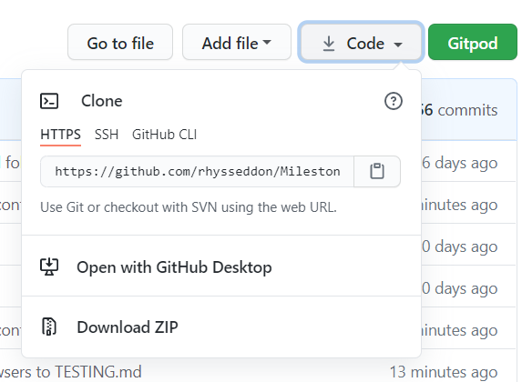

# Wepre Hall Website

## UX

### Purpose

As a local resident and having some interest in the local history after some research of the hall online, I discovered although there are various bits of information about the hall there is no one website dedicated to the hall itself. As the hall has been demolished my aim is to create a website to prevent the history of the hall being lost to time.

### User Stories

user 1: "I would like to know about the history of Wepre hall, why was it demolished?

user 2: "What did Wepre hall look like?"

user 3: "Where was the location of the hall and what is there now?"

user 4: "What are the visitor centre opening times?"  

### Strategy

As the site owner my goal is to consolidate all the past and present information about the hall into one place and provide users with this information in as simple a format as possible.  To achieve this, I aim to:
-	Give information of the history of the hall
-	Provide details of the present-day situation
-	Show pictures of what the hall used to look like
-	Give the halls location and visitor centre opening times

The target audience for the website is:
-	Local people wanting to know more about the history of the area
-	Visitors to the area looking for places to visit

### Scope

The website requirements and key functionality will include:

-	Users should be able to see a clear timeline of the history of the hall 
-	Users should be informed concisely what is now at the site of where the hall used to be
-	Image carousel of what the hall used to look like
-	Embedded map of the location of the site
-	Users should be given the opening times of the visitor centre
-	The approach should be within my current capabilities
-	Website should provide users with a clean and easy UX
-	Users shouldn’t be overwhelmed with too much information 
-	A contact me page

### Structure

The main objective of the website is to essentially provide information to a target audience of pretty much any age group or technical ability so it needs to be structured in as linear format as possible whilst still providing adequate information to the user.

### Skeleton

The website will contain 4 pages:
-	Home:  Image carousel, brief description of history and present day
-	History: Image, timeline of Wepre hall history
-	Visit: Image, description of the site now, visitor centre location and opening times. 
-	Contact: Image and contact form for people wishing for more information

Each of the pages will include:
-	Navbar: Will navigate between the pages
-	Footer: Links to wepre park website and leaflet download

#### Sketches

- <a href="assets/wireframes/Sketches.pdf" target="_blank" >Sketches</a>

#### Desktop Wireframes

- <a href="assets/wireframes/desktop-home.png" target="_blank" >Desktop Home</a>
- <a href="assets/wireframes/desktop-history.png" target="_blank" >Desktop History</a>
- <a href="assets/wireframes/desktop-visit.png" target="_blank" >Desktop Visit</a>
- <a href="assets/wireframes/desktop-contact.png" target="_blank" >Desktop Contact</a>

#### Mobile Wireframes

- <a href="assets/wireframes/mobile-home.png" target="_blank" >Mobile Home</a>
- <a href="assets/wireframes/mobile-history.png" target="_blank" >Mobile History</a>
- <a href="assets/wireframes/mobile-visit.png" target="_blank" >Mobile Visit</a>
- <a href="assets/wireframes/mobile-contact.png" target="_blank" >Mobile Contact</a>

#### Tablet view

The tablet view will be the same as the desktop view.

### Surface

#### Typography

- I decided on the use of the Playfair Display, serif font family as it has a old world feel to it which will match the theme for the old historic hall well. 

#### Colour Scheme

- Taking inspiration from the nationaltrust.org.uk as they will have a similar target demographic, use of strong pastel colours for header and footer that mix well with the images of the hall. And white space in-between content to aid readability 

## Features

### Navbar

- House Logo on the left-hand side next to name of website in a large font size.
- Navigation on the right side with links to home, history, contact and visit pages.
- Links will collapse into a burger icon when viewed on mobile.

### Footer

- Link to Wepre park Wikipedia page and Wikipedia icon.
- Link to download Wepre park leaflet and a download icon.
- Link to Instagram page with Instagram icon.

### Home Page

- Navbar.
- Full width image carousel with three scrollable high resolution images of the house.
- Overview section with binoculars icon next to heading with a paragraph of brief introduction to the website.
- The Hall Today section with suitable icon next to heading and a paragraph detailing what is currently happening at the site today.
- Footer.

### History Page

- Navbar.
- High resolution and large full width hero image relating to hall history.
- History heading with clock icon.
- Clear timeline of the history of the house, with bullet points for the dates and a title and description of what happened that year.
- Footer.

### Visit Page

- Navbar
- High resolution and large full width hero image of the park.
- Visit heading with car icon and a paragraph detailing what you can currently visit.
- Opening times heading with calender icon.
- Clear table detailing opening times.
- Embedded google map with location of hall, the ability to scroll the map and get directions.
- Footer.

### Contact Page

- Navbar
- High resolution and large full width hero image of the hall.
- Contact us title and speech bubble icon with a description of why to contact us
- Contact form that should meet the following parameters:
1) A Name input field that should be a requirement and if left out when clicking the submit button should display the error message “Please fill in this field”. 
2) Name field should have the placeholder “Name”.
3) An email input field that should be a requirement and if left out when clicking the submit button should display the error message “Please fill in this field”. 
4) If the email address field is missing an @ symbol it should display the error message “Please include an @ in the email address, “ “ Is missing an @”.  
5) Email field should have the placeholder “Email”.
6) A Message input that should be a required field and if left out when clicking the submit button should display the error message “Please fill in this field”. 
7) Message field should have the placeholder “Message”.
8) Submit radio button with the placeholder “Send”.

- Footer

### Features to implement later

- I would like to add functionality to the form so that when the data is submitted it get sent somewhere, this is currently beyond my skill set.

- In future I would like to develop a booking system so customers can book to a guided tour of the cellars beneath the visitor centre.

## Technologies used

### Languages

- Html: Used for the site structure.

- CSS: Used for adding styles to the website.

- Javascript: Used for CDNs to JQuery for nav bar burger and for font awesome for title icons.

### Libraries

- Bootstrap 4 : Used for creating navbar, image carousel, opening times table and used the grid system layout to make the website responsive.

- JQuery: Used for implementing the navbar burger collapse feature.

### IDE And Version Control

- Gitpod: Used as IDE environment.

- Git: Used for verion control.

- Github: Used for verion control and hosting.

### Tools 

- [LogoMakr.com](http://LogoMakr.com) - Used for the creation of the logo.

- [Fontawesome.com](http://Fontawesome.com) - Used for title icons.

- [Google fonts](http://Fonts.google.com) - Used for the fonts.

- [Coolers.co](http://Coolers.co) - Used for help with deciding on colour scheme.

- [Google Maps](http://Maps.google.com) - Used for embedded map feature.

- [Realfavicongenerator.net](http://Realfavicongenerator.net) - Used for creation, implementation and testing of favicon.

- [Validator.w3.org](http://Validator.w3.org) - Used for validation of HTML code when testing.

-  [Jigsaw.w3.org/css-validator](http://Jigsaw.w3.org/css-validator) - Used for validation of CSS code when testing.

- [Google.com/test/mobile-friendly](http://Search.google.com/test/mobile-friendly) - Used for testing the website mobile responsiveness.

- Google Chrome DevTools - Used for testing website responsiveness 

## Testing

[TESTING.md](TESTING.md) 

## Deployment

### Hosting

The website is hosted on GitHub pages on GitHub.com, where i saved all my repositories. The method I used for deployement was as follows:

- Logged into GitHub.com.
- Opened my repositories.
- Opened my Milestone 1 project repository.
- Under setting tab scrolled to GitHub Pages.
- Under source section selected branch > master and folder > root.
- Upon saving this my website was successfully deployed to  [https://rhysseddon.github.io/Milestone-1-Project/](https://rhysseddon.github.io/Milestone-1-Project/)

### Local Deployment

For local deployment:

- Login to GitHub.com.
- Open my repositories.

- Click code and download zip.

  

- Extract the zip file once downloaded and open documents in a browser.

## Credits

### Features

- Took some inspiration for the footer from CI mini project with Bootstap 4. 

- Took inspiration for the timeline feature from CI mini project with Bootstap 4 work history page.

- Contact form was inspired by CI mini project with Bootstap 4 contact page.

- Code to make the map responsive was sourced from OS training website.

- Javascript Code for the burger icon was sourced form stack overflow.

- Code for the logo was sourced from logoMakr.com.

- Code for the favicon was sourced form RealFavicongenerator.net

### Content

- The text on the home, history and visit pages was copied from the Wepre Park Wikipedia page everything else was written myself.
- The opening times I found on the Old Hall Cafe Facebook page.

### Images

All images are from open source from either [https://pixabay.com/](Pixabay.com) or [https://www.pexels.com/](Pexels.com)

## Difficulties Encountered
- The main problem I encountered was after deciding on building a website for Wepre Hall, I soon realised as the hall was demolished in the 1960s there was a very limited amount of pictures available and next to none of these were good enough quality. 
So I made the decision for decorative purposes I would substitute the old photographs for high quality images of similar settings. The original images of the hall and park are on the Wepre Park Wikipedia page and in the Wepre Park Leaflet and both can be found in the footer on the webpage.  
 

## Acknowlegements

- Friends and family for their honest opinions
- Code Institute Slack Channel for valuable guidance and opinions
- Mentor Rohit for guidance
