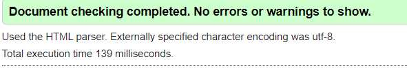
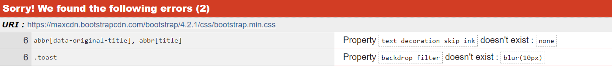

# Wepre Hall Website

## UX

As a local resident and having some interest in the local history after some research of the hall online, I discovered although there are various bits of information about the hall there is no one website dedicated to the hall itself. As the hall has been demolished my aim is to create a website to prevent the history of the hall being lost to time.

### User Stories

user 1: "I would like to know about the history of Wepre hall, why was it demolished?

user 2: "What did Wepre hall look like"

user 3: "Where was the location of the hall and what is there now?"

user 4: "What are the visitor centre opening times"  

### Strategy

As the site owner my goal is to consolidate all the past and present information about the hall into one place and provide users with this information in as simple a format as possible.  To achieve this, I aim to:
-	Give information of the history of the hall
-	Provide details of the present-day situation
-	Show pictures of what the hall used to look like
-	Give the halls location and visitor centre opening times

The target audience for the website is:
-	Local people wanting to know more about the history of the area
-	Visitors to the area looking for places to visit

### Scope

The website requirements and key functionality will include:

-	Users should be able to see a clear timeline of the history of the hall 
-	Users should be informed concisely what is now at the site of where the hall used to be
-	Image carousel of what the hall used to look like
-	Embedded map of the location of the site
-	Users should be given the opening times of the visitor centre
-	The approach should be within my current capabilities
-	Website should provide users with a clean and easy UX
-	Users shouldn’t be overwhelmed with too much information 
-	A contact me page

### Structure

The main objective of the website is to essentially provide information to a target audience of pretty much any age group or technical ability so it needs to be structured in as linear format as possible whilst still providing adequate information to the user.

### Skeleton

The website will contain 4 pages:
-	Home:  Image carousel, brief description of history and present day
-	History: Image, timeline of Wepre hall history
-	Visit: Image, description of the site now, visitor centre location and opening times. 
-	Contact: Image and contact form for people wishing for more information

Each of the pages will include:
-	Navbar: Will navigate between the pages
-	Footer: Links to wepre park website and leaflet download

#### Sketches

- <a href="assets/wireframes/Sketches.pdf" target="_blank" >Sketches</a>

#### Desktop Wireframes

- <a href="assets/wireframes/desktop-home.png" target="_blank" >Desktop Home</a>
- <a href="assets/wireframes/desktop-history.png" target="_blank" >Desktop History</a>
- <a href="assets/wireframes/desktop-visit.png" target="_blank" >Desktop Visit</a>
- <a href="assets/wireframes/desktop-contact.png" target="_blank" >Desktop Contact</a>

#### Mobile Wireframes

- <a href="assets/wireframes/mobile-home.png" target="_blank" >Mobile Home</a>
- <a href="assets/wireframes/mobile-history.png" target="_blank" >Mobile History</a>
- <a href="assets/wireframes/mobile-visit.png" target="_blank" >Mobile Visit</a>
- <a href="assets/wireframes/mobile-contact.png" target="_blank" >Mobile Contact</a>

#### Tablet view

The tablet view will be the same as the desktop view.

### Surface

Taking inspiration from the nationaltrust.org.uk as they will have a similar target demographic, use of strong pastel colours for header and footer that mix well with the images of the hall. And white space in-between content to aid readability 

## Features

- Navbar: Responsive Nav bar with logo and title on the left and page navigation on the right, which collapses into a burger icon when viewed on a mobile.

- Image Carousel: Large image carousel on home page, allows users to scroll through three hero images of the hall. 

- Timeline: Sets out history of the hall in a timeline down the page using custom attributes.

- Embedded Maps: Iframe to allow users to see the hall location on google maps.

- Contact form: A contact from with required fields and placeholders, with a submit radio button.

### Features to implement later

- I would like to add functionality to the form so that when the data is submitted it get sent somewhere, this is currently beyond my skill set.

## Technologies used

### Languages

- Html: Used for the site structure.

- CSS: Used for adding styles to the website.

- Javascript: Used for CDNs to JQuery for nav bar burger and for font awesome for title icons.

### Libraries

- Bootstrap 4 : Used for creating navbar, image carousel, opening times table and used the grid system layout to make the website responsive.

- JQuery: Used for implementing the navbar burger collapse feature.

### IDE And Version Control

- Gitpod: Used as IDE environment.

- Git: Used for verion control.

- Github: Used for verion control and hosting.

### Tools 

- [Link](http://LogoMakr.com) - Used for the creation of the logo.

- [Link](http://Fontawesome.com) - Used for title icons.

- [Link](http://Fonts.google.com) - Used for the fonts.

- [Link](http://Coolers.co) - Used for help with deciding on colour scheme.

- [Link](http://Maps.google.com) - Used for embedded map feature.

- [Link](http://Realfavicongenerator.net) - Used for creation, implementation and testing of favicon.

- [Link](http://Validator.w3.org) - Used for validation of HTML code when testing.

-  [Link](http://Jigsaw.w3.org/css-validator) - Used for validation of CSS code when testing.

- [Link](http://Search.google.com/test/mobile-friendly) - Used for testing the website mobile responsiveness.

## Testing

### W3 Validators

- Passed the HTML validator on second attempt, after fixing a bug (see bugs).

- CSS validator had two errors and both from the bootstrap CDN so cannot be changed.

### Mobile Friendly Test

- Passed the google mobile friendly test.

