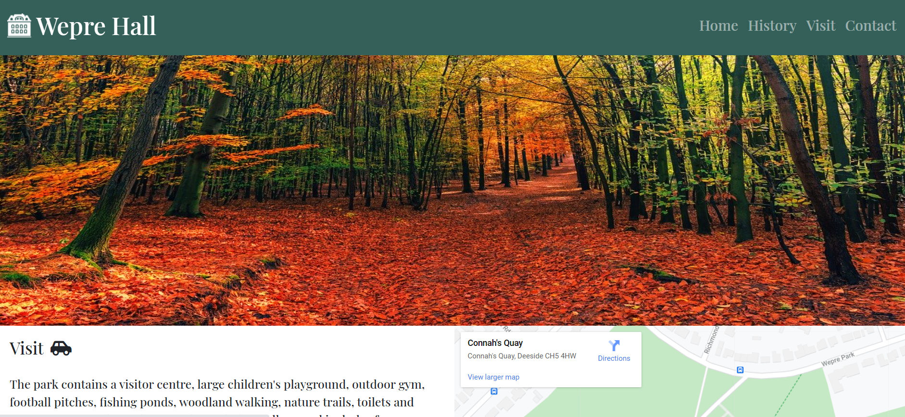

# Testing

## Home Page Test Case

### Navbar

- Navbar should have house logo on left next to title in a large font.
- House logo when clicked should direct to index.html. 
- On all navigation links the text should display brighter when the mouse is hovered over.
- First navigation link should be to home page and should direct to index.html when clicked.
- Second navigation link should be to history page and should direct to history.html when clicked.
- Third navigation link should be to visit page and should direct to visit.html when clicked.
- Fourth navigation link should be to contact page and should direct to contact.html when clicked.

- For small screen sizes less than 576px navigation links should collapse into burger icon.
- On all burger navigation links the text should display brighter when the mouse is hovered over.
- When burger icon clicked drop down menu should appear with the navigation links.
- First burger navigation link should be to home page and should direct to index.html.
- Second burger navigation link should be to history page and should direct to history.html when clicked.
- Third burger navigation link should be to visit page and should direct to visit.html when clicked.
- Fourth burger navigation link should be to contact page and should direct to contact.html when clicked.

### Image Carousel

- Should be full width image carousel with three high resolution scrollable images of the house.
- Carousel controls should be visible and should manually scroll through the three images left and right.
- Carousel indicator bar should be visible and should scroll to a different image when clicked.
- Carousel images should be responsive and not look squashed or stretched on desktops and in all the device sizes in DevTools. (see Devtools devices).

### Overview Section

- Should have the title “Overview”.
- Should have visible icon of binoculars next to title.
- Has paragraph with brief introduction under title.
- For screen sizes less than 768px the section should display full width above hall today section.
- For screen sizes more than 768px the section should display on the left next to hall today section.

### The Hall today Section

- Should have the title “The Hall Today”.
- Should have visible icon of calendar next to title.
- Has paragraph detailing what is currently happening at the site today under title.
- For screen sizes less than 768px the section should display full width below overview section.
- For screen sizes more than 768px the section should display on the right next to overview section.

### Footer

- Should contain three links and all should display brighter when mouse is hovered over.
- Should contain link to Wikipedia page with Wikipedia icon.
- When Wikipedia link is clicked should open Wikipedia page in new browser window
- Should contain link to download Wepre park leaflet with a download icon.
- When Wepre park leaflet link is clicked it should download the leaflet in a new window.
- Should contain link to Instagram page with Instagram icon.
- When Instagram link is clicked should open Instagram page in new browser window.
- Links should display clearly on all devices on DevTools (see Devtools).

### Desktop view

Website should appear as follows on a desktop:

### Mobile View

Website should appear as follows on mobile (example used iphone 6/7/8 plus):

## History Page Test Case

### Navbar

- Navbar should have house logo on left next to title in a large font.
- House logo when clicked should direct to index.html.
- On all navigation links the text should display brighter when the mouse is hovered over.
- First navigation link should be to home page and should direct to index.html when clicked.
- Second navigation link should be to history page and should direct to history.html when clicked.
- Third navigation link should be to visit page and should direct to visit.html when clicked.
- Fourth navigation link should be to contact page and should direct to contact.html when clicked.

- For small screen sizes less than 576px navigation links should collapse into burger icon.
- On all burger navigation links the text should display brighter when the mouse is hovered over.
- When burger icon clicked drop down menu should appear with the navigation links.
- First burger navigation link should be to home page and should direct to index.html.
- Second burger navigation link should be to history page and should direct to history.html when clicked.
- Third burger navigation link should be to visit page and should direct to visit.html when clicked.
- Fourth burger navigation link should be to contact page and should direct to contact.html when clicked.

### Hero Image

- Should have full width hero image relating to hall history.
- Image should be high resolution.
- Image should be responsive and not look squashed or stretched on desktops or in all the device sizes in DevTools. (see Devtools devices).

### History Section

- Should have title “History”.
- Should have clock icon next to the title.
- Displays a clear timeline of the history of the house, with bullet points for the dates and a title and description of what happened that year.

### Footer

- Should contain three links and all should display brighter when mouse is hovered over.
- Should contain link to Wikipedia page with Wikipedia icon.
- When Wikipedia link is clicked should open Wikipedia page in new browser window.
- Should contain link to download Wepre park leaflet with a download icon.
- When Wepre park leaflet link is clicked it should download the leaflet in a new window.
- Should contain link to Instagram page with Instagram icon.
- When Instagram link is clicked should open Instagram page in new browser window.
- Links should display clearly on all devices on DevTools (see Devtools).

### Desktop view

Website should appear as follows on a desktop:

### Mobile View

Website should appear as follows on mobile (example used iphone 6/7/8 plus):

## Visit Page Test Case

### Navbar

- Navbar should have house logo on left next to title in a large font.
- House logo when clicked should direct to index.html.
- On all navigation links the text should display brighter when the mouse is hovered over.
- First navigation link should be to home page and should direct to index.html when clicked.
- Second navigation link should be to history page and should direct to history.html when clicked.
- Third navigation link should be to visit page and should direct to visit.html when clicked.
- Fourth navigation link should be to contact page and should direct to contact.html when clicked.

- For small screen sizes less than 576px navigation links should collapse into burger icon.
- On all burger navigation links the text should display brighter when the mouse is hovered over.
- When burger icon clicked drop down menu should appear with the navigation links.
- First burger navigation link should be to home page and should direct to index.html.
- Second burger navigation link should be to history page and should direct to history.html when clicked.
- Third burger navigation link should be to visit page and should direct to visit.html when clicked.
- Fourth burger navigation link should be to contact page and should direct to contact.html when clicked.

### Hero Image

- Should have full width hero image of the park.
- Image should be high resolution.
- Image should be responsive and not look squashed or stretched on desktops or in all the device sizes in DevTools. (see Devtools devices).

### Visit Section

- Should have title “Visit”.
- Should have car icon next to the title.
- Has paragraph of text on visiting site.
- Should have smaller heading “opening times” with a calendar icon.
- Should have a table clearly displaying opening times.
- For screen sizes less than 768px the section should display full width above embedded map.
- For screen sizes larger than 768px the section should display on the left next to the embedded map.

### Embedded Map

- Should display embedded google maps.
- Map should be scrollable and should show location of the hall.
- When “view larger map” is clicked google maps should appear in a new browser window.
- Map should be responsive and not look squashed or stretched on desktops or in all the device sizes in DevTools. (see Devtools devices).
- For screen sizes less than 768px the map should display full width below visit section.
- For screen sizes larger than 768px the map should display on the right next to the visit section.

### Footer

- Should contain three links and all should display brighter when mouse is hovered over.
- Should contain link to Wikipedia page with Wikipedia icon.
- When Wikipedia link is clicked should open Wikipedia page in new browser window.
- Should contain link to download Wepre park leaflet with a download icon.
- When Wepre park leaflet link is clicked it should download the leaflet in a new window.
- Should contain link to Instagram page with Instagram icon.
- When Instagram link is clicked should open Instagram page in new browser window.
- Links should display clearly on all devices on DevTools (see Devtools).

### Desktop view

Website should appear as follows on a desktop:

### Mobile View

Website should appear as follows on mobile (example used iphone 6/7/8 plus):

## Contact Page Test Case

### Navbar

- Navbar should have house logo on left next to title in a large font.
- House logo when clicked should direct to index.html.
- On all navigation links the text should display brighter when the mouse is hovered over.
- First navigation link should be to home page and should direct to index.html when clicked.
- Second navigation link should be to history page and should direct to history.html when clicked.
- Third navigation link should be to visit page and should direct to visit.html when clicked.
- Fourth navigation link should be to contact page and should direct to contact.html when clicked.

- For small screen sizes less than 576px navigation links should collapse into burger icon.
- On all burger navigation links the text should display brighter when the mouse is hovered over.
- When burger icon clicked drop down menu should appear with the navigation links.
- First burger navigation link should be to home page and should direct to index.html.
- Second burger navigation link should be to history page and should direct to history.html when clicked.
- Third burger navigation link should be to visit page and should direct to visit.html when clicked.
- Fourth burger navigation link should be to contact page and should direct to contact.html when clicked.

### Hero Image

- Should have full width hero image relating to hall.
- Image should be high resolution.
- Image should be responsive and not look squashed or stretched on desktops or in all the device sizes in DevTools. (see Devtools devices).

### Contact Us Section

- Should have title “Contact Us”.
- Should have speech bubble icon next to the title.
- Should have a sentence on why to contact us.
- Form should have a name input field that should be a requirement and if left out when clicking the submit button should display the error message “Please fill in this field”.
- Name field should have the placeholder “Name”.
- Form should have an email input field that should be a requirement and if left out when clicking the submit button should display the error message “Please fill in this field”.
- If the email address field is missing an @ symbol it should display the error message “Please include an @ in the email address, “ “ Is missing an @”.
- Email field should have the placeholder “Email”.
- Form should have a message input that should be a required field and if left out when clicking the submit button should display the error message “Please fill in this field”.
- Message field should have the placeholder “Message”.
- Form should have a Submit radio button with the placeholder “Send”.

### Footer

- Should contain three links and all should display brighter when mouse is hovered over.
- Should contain link to Wikipedia page with Wikipedia icon.
- When Wikipedia link is clicked should open Wikipedia page in new browser window.
- Should contain link to download Wepre park leaflet with a download icon.
- When Wepre park leaflet link is clicked it should download the leaflet in a new window.
- Should contain link to Instagram page with Instagram icon.
- When Instagram link is clicked should open Instagram page in new browser window.
- Links should display clearly on all devices on DevTools (see Devtools).

### Desktop view

Website should appear as follows on a desktop:

### Mobile View

Website should appear as follows on mobile (example used iphone 6/7/8 plus):

## Devtools

The website was extensively tested for responsiveness in google chrome devtools in the following devices:

- Moto G4
- Galaxy S5
- Pixel 2
- Pixel 2 XL
- Phone 5/SE
- Phone 6/7/8
- Phone 6/7/8 Plus
- Phone X
- Ipad
- Ipad Pro
- Surface Duo
- Galaxy Fold

## Browsers

The website was tested for responsiveness on the following browsers:

- Google chrome
- Safari
- Microsoft Edge
- Firefox

## Friends and family

I requested some feedback from friends and family on the how website displays on there devices, so was tested on iphone 7, iphone 8, iphone 11, ipad and two laptop with computers one with chrome the other with safari, the website looked good on all of these screen sizes.

## Mobile Friendly Test

- Passed the google mobile friendly test.

## User Story Testing Outcomes

- user 1: "I would like to know about the history of Wepre hall, why was it demolished?  
  These questions are answered on the history page.

- user 2: "What did Wepre hall look like?"  
  Images of the hall are displayed on the home, history and contact page.

- user 3: "Where was the location of the hall and what is there now?"  
  This is addressed on the visit page.

- user 4: "What are the visitor centre opening times?"  
  This information can be found on the visit page.

## Fixed Bugs

- Burger icon drop down menu did not appear, to fix I found the answer on stack overflow and copied the code from there - I had to add some javascript to the pages this is mentioned in a comment above the code itself.

- Footer links were underlined, to fix I added a css class and set: `text-decoration: none;`

- Carousel had white space either side, to fix I found the answer on stack overflow and added `img-responsive` bootstrap class to carousel HTML.

- Embedded maps wasnt responsive in all views, to fix I found the answer on OS training website and copied there `map-responsive` css classes.

- When testing in Devtools I found in the galaxy fold view the content text on the home page was encroaching into the footer, I found the problem was because I had added a height to the class for the content and that was stopping the bootstrap grid system from working. So to fix I removed the height property.

- Failed HTML W3 validator because I had the hero image as a section element with no headings, to fix changed it to an aside element.

- When testing in Devtools, ipad pro view had whitespace below the footer on index.html and contact.html, to fix this I add media queries for the ipad pro view size and added a `min-height`.

- Deleted websitemanifest file and links to it as it was causing an error in firefox. The file was copied over in the files from Realfavicongenerator.net.

## Outstanding Bugs

- CSS validatior had 2 errors both were from the bootstaps CDN so could not be changed.

## Other Issues

- During a review with my mentor he mentioned that some of the pages required alot of scrolling to the top of the page to get to the navbar to navigate and is not a very good user experience, to fix this I decided to make the navbar fixed to the top of the page by adding the bootstrap 4 class `sticky-top`.

## Return to [README.md](README.md)
